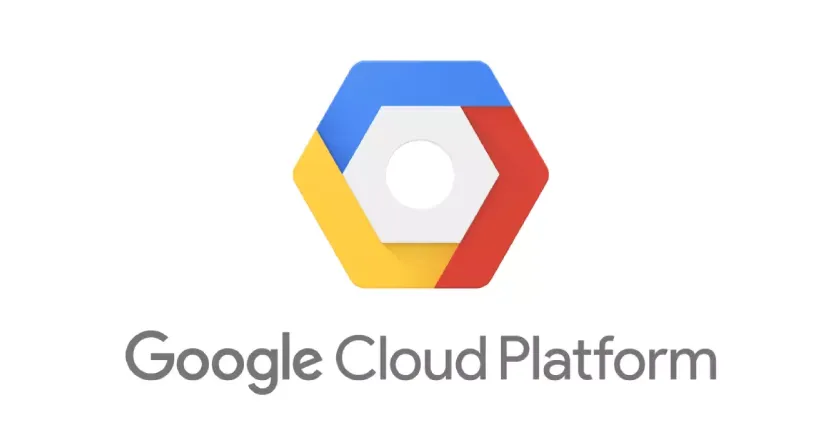

# ITS-OK | Final Project Pengembangan Sistem dan Operasi (PSO)

<p align="center">
  <a href="https://tekan.id/ITSOK" target="_blank">Access ITS-OK Here!</a>
</p>

## Product Description 
### Latar Belakang
Mahasiswa di Indonesia, termasuk di Institut Teknologi Sepuluh Nopember (ITS), menghadapi tantangan besar dalam menjaga kesehatan mental mereka. Tingginya tingkat stres akademik, tekanan sosial, serta kurangnya akses ke layanan kesehatan mental yang cepat dan berkualitas menjadi faktor utama yang mempersulit mahasiswa untuk mendapatkan bantuan yang mereka butuhkan. Saat ini, dukungan psikologis yang tersedia di kampus masih terbatas, baik dari segi jumlah tenaga profesional maupun kemudahan akses terhadap layanan tersebut.
Kami akan membuat sebuah aplikasi sebagai wadah bagi mahasiswa ITS untuk mendapatkan layanan kesehatan mental. Dalam proyek ini, kelompok kami berfokus pada penerapan alat DevOps untuk proses build dan deployment aplikasi serta pemantauan aktivitas di dalamnya. 
### Tujuan
Pengembangan aplikasi berbasis website bernama ITS-OK memiliki tujuan sebagai sebuah platform digital yang dapat menyediakan akses cepat dan mudah ke layanan kesehatan mental bagi mahasiswa ITS. Aplikasi ini dirancang untuk memberikan solusi berupa platform untuk mendaftar konsultasi offline melalui Student Health and Counseling Center (SHCC) ITS. Dengan adanya ITS-OK, mahasiswa dapat memperoleh bantuan profesional maupun sumber daya pendukung lainnya secara lebih efektif dan efisien.
### Manfaat 
Dengan demikian, diharapkan website ITS-OK dapat meningkatkan kesadaran mahasiswa akan pentingnya menjaga kesehatan mental, serta memberikan akses yang lebih luas dan fleksibel terhadap layanan kesehatan mental di lingkungan kampus. Melalui fitur-fitur yang tersedia, mahasiswa dapat dengan mudah mendapatkan dukungan psikologis yang mereka butuhkan, sehingga kesejahteraan mental mereka dapat terjaga, yang pada akhirnya akan berdampak positif pada performa akademik dan kehidupan sosial mereka.
## Product Features
Fitur yang ada pada ITS OK berfokus untuk memberikan pelayanan yang terbaik untuk mahasiswa (pelanggan). Fitur yang ada pada aplikasi kami adalah sebagai berikut: 
- **Mahasiswa**
    - Konsultasi Offline: Mahasiswa bisa melakukan registrasi untuk konsultasi tatap muka di SHCC ITS dengan mengisi formulir dan memilih jadwal yang tersedia.
    - Lagu Tenang: Kumpulan lagu yang bisa diakses oleh mahasiswa untuk membantu ketenangan mental.

## Tools & Software yang digunakan
Dalam proyek DevOps ini, kami memanfaatkan beragam tools dan framework yang memiliki fungsi beragam, mulai dari version control, CI/CD, pengembangan frontend dan backend, hingga pemindaian keamanan serta pemantauan aplikasi. Rincian lengkap mengenai tools dan framework yang digunakan dapat dilihat pada daftar berikut:
- Version Control
    - GitHub
- CI/CD
    - GitHub Action
- Development Environtment
    - VSCode
- Framework Code
    - Next.js
- DevOps Supporting Tools
    - ESLint
    - SonarCloud
    - Jest
    - Docker
    - Firestore
    - Google Cloud Platform
### GitHub
<p align="center"></p>

GitHub merupakan platform berbasis web yang memanfaatkan Git sebagai sistem version control untuk mengelola source code serta memantau setiap perubahan yang terjadi dalam proses pengembangan perangkat lunak. Dalam proyek ini, kami juga menggunakan fitur GitHub Project untuk membantu manajemen tugas, dengan memanfaatkan template yang telah disediakan. Pengelolaan proyek dilakukan melalui metode kanban board, yang memberikan visualisasi progres tugas secara jelas dan terstruktur.
### GitHub Actions


GitHub Actions adalah fitur otomatisasi bawaan di GitHub yang memungkinkan kamu untuk menjalankan workflow secara otomatis berdasarkan event tertentu, seperti push, pull request, atau merge.
GitHub Actions sangat umum digunakan untuk menerapkan CI/CD (Continuous Integration dan Continuous Deployment/Delivery) secara langsung di dalam ekosistem GitHub, tanpa memerlukan layanan eksternal.
1. Continuous Integration (CI)
    - Secara otomatis menjalankan build dan testing setiap kali ada perubahan kode (misalnya setelah push atau pull request).
    - Memastikan bahwa setiap commit tidak merusak sistem atau menyebabkan error.
2. Continuous Deployment/Delivery (CD)
    - Setelah kode lolos pengujian, GitHub Actions dapat secara otomatis men-deploy ke server dan publish aplikasi ke staging atau production environment.
### VSCode


Visual Studio Code (VSCode) adalah code editor yang digunakan sebagai development environment dalam proyek ini. VSCode menyediakan berbagai fitur pendukung pengembangan seperti syntax highlighting, IntelliSense (auto-complete pintar), integrasi Git, serta dukungan terhadap berbagai ekstensi seperti ESLint, Prettier, dan Docker, yang sangat membantu dalam meningkatkan produktivitas dan menjaga kualitas kode. Selain itu, tampilannya yang ringan namun powerful membuatnya cocok untuk kolaborasi dan pengembangan lintas platform secara efisien.
### Next.js


Next.js adalah framework berbasis React yang dikembangkan oleh Vercel, dirancang untuk membangun aplikasi web modern dengan performa tinggi. Framework ini mendukung berbagai metode rendering seperti Server-Side Rendering (SSR), Static Site Generation (SSG), dan hybrid rendering, serta dilengkapi dengan fitur routing otomatis, optimasi kinerja, dan API bawaan. Dengan kemudahan konfigurasi dan skalabilitas yang baik, Next.js sangat cocok digunakan untuk proyek web yang membutuhkan kecepatan, SEO, dan pengelolaan struktur aplikasi yang efisien.
### ESLint


ESLint adalah alat statis untuk menganalisis kode JavaScript dan TypeScript guna menemukan serta memperbaiki masalah yang berkaitan dengan kualitas dan konsistensi penulisan kode. Dalam proyek ini, digunakan NextLint, yaitu konfigurasi ESLint yang telah disesuaikan secara default oleh Next.js. NextLint membantu memastikan bahwa kode yang ditulis mengikuti standar dan praktik terbaik yang direkomendasikan oleh Next.js, serta memudahkan pengembang dalam menjaga keteraturan struktur kode dan mencegah potensi bug sejak dini.
### Jest


Jest adalah framework pengujian JavaScript yang digunakan untuk melakukan unit testing secara efisien dan cepat. Dalam proyek ini, Jest dimanfaatkan untuk memastikan bahwa setiap fungsi atau komponen aplikasi berjalan sesuai dengan yang diharapkan melalui serangkaian pengujian terautomasi. Jest mendukung fitur seperti mocking, snapshot testing, dan coverage report, yang membantu dalam mendeteksi bug lebih awal serta menjaga kestabilan aplikasi selama proses pengembangan. Integrasi Jest juga berjalan mulus dengan framework seperti Next.js, sehingga cocok digunakan dalam alur pengujian proyek ini.
### SonarCloud


SonarCloud adalah layanan berbasis cloud yang digunakan untuk menganalisis kualitas kode secara otomatis dengan fokus pada aspek seperti bugs, code smells, vulnerabilities, dan code coverage. Dalam proyek ini, SonarCloud digunakan setelah proses testing dengan Jest untuk melakukan pemeriksaan lanjutan terhadap kualitas dan keamanan kode secara menyeluruh. Integrasinya dengan GitHub dan GitHub Actions memungkinkan analisis berjalan otomatis setiap kali ada perubahan kode, sehingga membantu tim dalam menjaga standar kualitas, mengurangi risiko kesalahan di production, serta memantau performa kode secara berkelanjutan.
### Docker


Docker adalah platform open-source yang digunakan untuk membuat, menjalankan, dan mengelola aplikasi dalam wadah (container) yang ringan dan terisolasi. Dalam konteks pengembangan perangkat lunak, Docker memungkinkan pengembang untuk membungkus aplikasi beserta semua dependensi dan konfigurasi yang dibutuhkan ke dalam satu container, sehingga aplikasi dapat dijalankan dengan konsisten di berbagai lingkungan. Dengan menggunakan Docker, proses deployment menjadi lebih cepat, reproducible, dan mudah diintegrasikan ke dalam pipeline CI/CD, termasuk dalam proyek ini untuk memastikan bahwa aplikasi dapat dijalankan secara stabil dan efisien di berbagai tahap pengembangan maupun produksi.
### Firestore


Firestore adalah layanan basis data NoSQL berbasis cloud yang dikembangkan oleh Google sebagai bagian dari platform Firebase. Firestore dirancang untuk menyimpan dan menyinkronkan data secara real-time, serta mendukung struktur data berbasis dokumen dan koleksi yang fleksibel. Dalam proyek ini, Firestore digunakan sebagai backend untuk menyimpan data aplikasi, seperti informasi pengguna, catatan, atau konfigurasi sistem, dengan keunggulan akses data yang cepat, skalabilitas tinggi, dan kemampuan integrasi langsung dengan layanan Google lainnya. Selain itu, Firestore juga mendukung operasi offline dan real-time update, sehingga sangat cocok untuk aplikasi modern berbasis web maupun mobile.
### Google Cloud Platform (GCP)


Google Cloud Platform (GCP) adalah layanan cloud dari Google yang menyediakan infrastruktur dan alat untuk menyimpan, mengelola, serta menjalankan aplikasi secara online. Dalam konteks deployment, GCP memungkinkan pengembang untuk menyebarkan aplikasi ke cloud melalui berbagai layanan seperti App Engine (platform-as-a-service untuk aplikasi web), Cloud Run (untuk menjalankan container secara serverless), atau Compute Engine (virtual machine dengan kontrol penuh). Proses deployment di GCP umumnya melibatkan pembuatan project, konfigurasi file deployment (seperti app.yaml untuk App Engine), lalu menggunakan perintah seperti gcloud app deploy untuk mengunggah dan menjalankan aplikasi secara otomatis di lingkungan production.

## Langkah Proses
Bagian ini adalah tahapan-tahapan dalam menyiapkan setiap tools yang digunakan dalam proses DevOps pada proyek ini.
### GitHub
1. Membuat akun GitHub melalui https://github.com/ untuk dapat mengelola repository dan berkolaborasi dalam proyek.
2. Setelah memiliki akun, membuat repository baru yang akan digunakan sebagai tempat menyimpan seluruh kode sumber proyek.
3. Repository yang telah dibuat dikloning ke local machine agar proses pengembangan dapat dilakukan secara lokal di komputer masing-masing developer.
4. Setelah proses cloning berhasil, pengembangan aplikasi atau website dapat langsung dimulai menggunakan code editor pilihan.
5. Dalam setiap proses pengembangan, penting untuk menerapkan best practice dalam penamaan branch dan commit agar struktur version control tetap rapi dan mudah dilacak.
6. Untuk setiap fitur yang akan dikembangkan, dibuat backlog atau issue di GitHub agar progres pekerjaan bisa dimonitor dan terorganisir dengan baik.
7. Developer kemudian mengerjakan fitur pada branch yang sesuai dengan issue yang telah dibuat, sehingga pengelolaan kode lebih terstruktur.
8. Dalam proyek PSOGacor, branch dibagi menjadi dua bagian utama: master sebagai branch utama yang berisi kode siap rilis, dan branch fitur yang digunakan untuk mengembangkan atau memodifikasi fitur tertentu.
9. Setelah pengembangan fitur selesai dan telah diuji, dilakukan pull request dari branch fitur ke branch main agar perubahan dapat digabungkan ke versi utama aplikasi.


### GitHub Actions
1. Untuk menggunakan GitHub Actions, ikuti panduan pada tautan berikut: https://docs.github.com/en/actions/writing-workflows/quickstart.
2. Buat folder .github/workflows di dalam repository sebagai tempat menyimpan file konfigurasi workflow.
3. Buat file YAML yang berisi konfigurasi pipeline CI/CD sesuai kebutuhan proyek.
4. Dalam proyek ini kami membuat 2 file YAML, yaitu ci.yml dan cd.yml
5. Pipeline ci.yml dijalankan secara otomatis ketika terdapat pull request dari branch fitur ke branch main, dan akan menjalankan proses pengecekan ESLint, Jest, dan SonarCloud.
6. Pipeline cd.yml dijalankan secara otomatis ketika ci berhasil dijalankan. Disini akan dilakukan keseluruhan konfigurasi GCP dan Docker.


### Next.js
1. Pertama install Node.js di VSCode. Cek versi di terminal dengan node -v dan npm -v.
2. Kemudian buat project baru dengan membuka terminal di VSCode, lalu jalankan npx create-next-app@latest nama-proyek.
3. Jalankan proyek secara lokal dengan npm run dev. Kemudian jika muncul http://localhost:3000, buka browser dan akses link url tersebut atau Ctrl + klik pada urlnya.
4. Pahami dan atur struktur folder.
5. Setup VSCode Extensions → Install ESLint, Prettier, Tailwind CSS IntelliSense (jika pakai Tailwind), JavaScript/TypeScript React Snippets, dan GitLens (jika pakai Git).
6. Tambahkan git:
    - git init
    - git add .
    - git commit -m "Initial commit"
7. Kemudian push ke GitHub dengan:
    - git remote add origin https://github.com/username/repo.git
    - git push -u origin main


### Firebase
1. Membuka https://console.firebase.google.com untuk membuat project baru sebagai backend dari aplikasi.
2. Login menggunakan akun Google yang dimiliki, lalu klik tombol “Add project” dan ikuti panduan pembuatan project seperti pengisian nama dan pengaturan Google Analytics.
3. Setelah project berhasil dibuat, klik ikon Web (</>) untuk menambahkan aplikasi berbasis web agar Firebase dapat terhubung ke project frontend.
4. Salin konfigurasi kode JavaScript yang ditampilkan oleh Firebase. Konfigurasi ini berisi parameter seperti apiKey, authDomain, dan projectId.
5. Buat folder lib/ di root direktori proyek jika belum ada, lalu buat file firebase.ts di dalamnya.
6. Tempelkan konfigurasi Firebase ke dalam file firebase.ts, lalu inisialisasikan Firebase App dan Firestore menggunakan SDK Firebase.
7. Jalankan perintah berikut di terminal untuk menginstal SDK Firebase ke dalam project:
```
npm install firebase
```


### Firestore
1. Buka kembali Firebase Console, lalu pilih menu “Firestore Database” dari sidebar kiri.
2. Klik tombol “Create database”, pilih mode production atau test, lalu pilih lokasi server sesuai kebutuhan (misalnya Asia Tenggara/Singapura).
3. Setelah Firestore aktif, database siap digunakan untuk menyimpan dan membaca data dari aplikasi.
4. Untuk menggunakan Firestore di dalam aplikasi, impor db dari file firebase.ts.
5. Gunakan fungsi-fungsi dari firebase/firestore seperti collection, addDoc, getDocs, query, dan Timestamp untuk operasi CRUD data.
6. Struktur import pada file kode biasanya ditulis seperti berikut (sesuaikan dengan kode masing-masing):
```
import { db } from "@/lib/firebase";
import {
  collection,
  addDoc,
  Timestamp,
  query,
  where,
  getDocs,
} from "firebase/firestore";
```


### Docker
1. Download dan Install Docker Desktop
- Kunjungi: [https://www.docker.com/products/docker-desktop/](https://www.docker.com/products/docker-desktop/)
- Pilih versi sesuai arsitektur perangkat:
  - **Windows/Mac ARM** (contoh: Mac M1/M2, Surface Pro X)
  - **Windows/Mac AMD/Intel** (umumnya laptop/PC biasa)
- Ikuti proses instalasi dan **aktifkan WSL2** saat diminta.

2. Cek apakah Docker sudah terinstal dan berjalan
Buka terminal atau CMD dan jalankan perintah berikut:
```bash
docker -v
docker info
```
Pastikan tidak ada error dan status menampilkan **Docker Engine is running**.

3. Siapkan File Proyek dan Buat `Dockerfile`
Contoh struktur sederhana:
```
├── Dockerfile
├── package.json
├── ...
```

Contoh isi `Dockerfile` (untuk Next.js di port 8080):
```dockerfile
FROM node:18-alpine

WORKDIR /app

COPY package.json package-lock.json* ./
RUN npm install

COPY . .

RUN npm run build

EXPOSE 8080
ENV PORT=8080

CMD ["npx", "next", "start", "-p", "8080"]
```

4. Build Image dari Dockerfile
Jalankan perintah berikut untuk membangun image:
```bash
docker build -t psogacor .
```
> `psogacor` adalah nama image, bisa diganti sesuai kebutuhanmu.

5. Jalankan Container dari Image
Setelah proses build berhasil, jalankan container dengan:
```bash
docker run -p 8080:8080 psogacor
```

Akses aplikasi melalui browser:
```
http://localhost:8080
```


### GCP
1. Persiapkan akun GCP dengan saldonya, karena untuk deploy kesebuah server, biasanya butuh saldo. Disini kami menggunakan free saldo sebesar $300 dengan durasi 3 bulan.
2. Setelah itu, masuk ke halaman cloud run dan artifact registery untuk meng enable kedua halaman itu. Cloud run digunakan untuk mendeploy dan mengatur mulai dari server yang akan digunakan, port, memory, security, dan lainnya. Sementara, untuk artifact registery digunakan untuk mempush docker image local yang sebelumnya dibuat, ke docker google cloud yang berhubungan dengan cloud run itu juga.
3. Selanjutnya adalah konfigurasi pada halaman IAM & Admin. Disini dilakukan untuk menambah service account utama yang dapat digunakan agar pipeline dapat melakukan keseluruhan proses pada GCP melalui credentials (pada CD). Hal ini sangat diperlukan karena kami melakukan otomasi proses CI/CD.
4. Setelah melakukan konfigurasi ketiga hal tersebut, pastikan CD terautentikasi dengan baik oleh konfigurasi yang ada, mulai dari nama, credentials, token, id, dan lainnya. Hal ini harus dipastikan benar supaya GCP berhasil mendeploy aplikasi kita ke server.


### Monitoring
1. Setelah pipeline diatur dengan baik dan konfigurasi server diatur dengan baik sehingga aplikasi dapat dijalankan di server. Monitoring dapat dilakukan dengan beberapa tools berbeda, namun pada kasus ini kami menggunakan monitoring GCP.
2. Monitoring yang dilakukan yang pertama dengan mengatur dashboard agar bisa langsung terlihat monitoring sesuai pilihan contohnya seperti request latency by service atau request count by service.
3. Setelah dashboard diatur, disini kita dapat mengatur metric apa saja yang mau kita explore, contohnya adalah log explorer. Ini digunakan agar kita bisa memonitoring log dari keseluruhan resource project yang ada di google cloud. Disini kita bisa analisa performa/traffic.
4. Setelah mengatur apa-apa saja yang ingin di monitoring, disini dilakukan konfigurasi untuk alerting, agar nantinya kita bisa langsung mengetahui jika ada masalah dari keseluruhan proses project sesuai dengan monitoringnya tadi. Contohnya, kami mengatur agar ketika request count tidak sesuai threshold, maka akan langsung diinfokan melalui gmail.


## Penjelasan Pipeline
### Continuous Integration
1. Konfigurasi GitHub Actions workflow
<pre>
name: CI

on:
  push:
    branches: ['*']
  pull_request:
    branches: [master]
</pre>
Kode di atas menjelaskan konfigurasi workflow pipeline yang diberi nama CI dan akan secara otomatis berjalan apabila terdapat** pull request** dari branch fitur ke master dan ketika melakukan **push** pada seluruh branch. Tujuan kami melakukan hal itu karena agar CI terus di cek, ketika tim melakukan push pada branch dan ketika tim akan melakukan PR ke master. Sehingga nantinya kode akan bersih ketika sudah memasuki master.

2. Setup environment, Checkout repository, dan Setup node.js
<pre>
jobs:
  lint-and-test:
    runs-on: ubuntu-latest
    steps:
      - name: Checkout repository
        uses: actions/checkout@v3

      - name: Setup Node.js 18.x
        uses: actions/setup-node@v3
        with:
          node-version: 18
</pre>
Kode di atas memastikan semua proses pada job dijalankan dalam virtual machines (OS) ubuntu terbaru yang disediakan oleh github actions. Hal ini akan menjamin environment yang standar dan konsisten. Setelah itu kode di atas juga memastikan step checkout atau clone source code dari repository github ke vm (environment runner) ini. Setelah itu, step nya akan melakukan instalasi dan aktivasi node js versi 18 pada environment tadi. Hal ini memastikan versi node.js yang digunakan sesuai dengan kebutuhan project dan agar perintah npm serta proyek berbasis node bisa dijalankan.

3. Install Depedencies
<pre>
      - name: Install dependencies
        run: npm install
</pre>
Pada tahap ini, kode memastikan instalasi seluruh depedency/project depedencies yang dibutuhkan proyek. Hal ini dilakukan untuk menghindari perbedaan version dan perbedaan environment atau kekurangan depedency.

4. Tahap Linting (ESLint Check)
<pre>
      - name: Run ESLint
        run: npm run lint
</pre>    
Pada tahap ini, workflow menjalankan linting untuk memastikan kode mengikuti standar style dan tidak ada kesalahan syntax. Step ini memastikan seluruh kode JavaScript/TypeScript yang ada di repository telah memenuhi aturan yang didefinisikan oleh ESLint, sehingga meminimalisir error saat build atau runtime.

5. Tahap Testing (Unit Test dengan Coverage)
<pre>
      - name: Run Tests with Coverage
        run: npm run test -- --coverage
</pre>
Rahap ini adalah menjalankan unit test menggunakan Jest untuk memverifikasi fungsi-fungsi aplikasi bekerja sesuai ekspektasi. Kode ini akan mengeksekusi seluruh test unit yang sudah dibuat pada aplikasi, dan coverage akan memberikan laporan insight seberapa banyak kode yang telah diuji. Juga, Pipeline akan gagal jika terdapat test yang tidak lolos.

6. Upload artifact coverage
<pre>
      - name: Upload coverage artifact
        uses: actions/upload-artifact@v4
        with:
          name: coverage
          path: coverage/
</pre>
Pada tahap ini, setelah tes dilakukan, hasil laporan coverage akan diupload dan dibungkus dalam artifact dengan nama coverage. Hal ini dilakukan sehingga bisa di download manual dan diakses melalui github actions, jadi bisa dilakukan checking langsung di folder laptop. Selain itu, file ini diupload agar bisa digunakan pada job selanjutnya yaitu job sonarcloud.

7. Tahap Build Project
<pre>
      - name: Build Project
        run: npm run build
</pre>
Setelah tahap lint, test, dan analisis, workflow dapat melakukan build aplikasi. Build ini digunakan untuk mengubah kode mentah menjadi kode yang siap dijalankan di server atau browser. Hal ini dilakukan agar import/export modern JS/TS/lainnya diubah menjadi bentuk yang kompatible dengan semua environment. Build hanya dijalankan jika lint dan test lolos.

8. Tahap konfigurasi dengan SonarCloud
<pre>
sonarcloud-scan:
    needs: lint-and-test
    runs-on: ubuntu-latest
    steps:
      - name: Checkout repository
        uses: actions/checkout@v3

      - name: Download coverage artifact
        uses: actions/download-artifact@v4
        with:
          name: coverage
          path: coverage/
</pre>
Tahap ini akan membuat job baru yang akan dijalankan setelah job lint-and-test berhasil dijalankan dengan nama job sonarcloud-scan. Disini menyesuaikan OS juga seperti di awal dan mengambil kode dengan checkout repository. Setelah itu, sonarcloud akan mengambil artifact dari coverage yang sebelumnya sudah diupload.

9. Tahap analisis code dengan SonarCloud
<pre>
- name: SonarCloud Scan
        uses: SonarSource/sonarcloud-github-action@v2
        with:
          projectBaseDir: .
        env:
          SONAR_TOKEN: ${{ secrets.SONAR_TOKEN }}
</pre>
Selanjutnya workflow akan menjalankan analisis kualitas kode menggunakan SonarCloud. SonarCloud akan melakukan analisis terhadap potensi bug, code smell, serta kualitas testing secara otomatis. Kode ini akan mengupload hasil analisis ke dashboard SonarCloud agar dapat dipantau oleh developer/maintainer. Pada tahap ini juga dibutuhkan token rahasia (SONAR_TOKEN) yang sudah dikonfigurasikan di repo.

### Continuous Deployment
1. Konfigurasi GitHub Actions Workflow untuk CD
<pre>
name: CD

on:
  workflow_run:
    workflows: ["CI"]
    types:
      - completed
</pre>
Potongan kode di atas mengatur agar workflow bernama CD berjalan secara otomatis setiap kali workflow CI selesai dijalankan, baik karena push atau pull request. Namun workflow CD tidak langsung dijalankan sembarang waktu, karena pada bagian jobs terdapat kondisi tambahan:
<pre>
jobs:
  deploy-production:
    if: >
      github.event.workflow_run.conclusion == 'success' &&
      github.event.workflow_run.head_branch == 'master'
</pre>
Kondisi ini menyaring agar CD hanya dijalankan jika CI berhasil (success) dan berasal dari branch master.
Artinya, workflow ini memang didesain sebagai pipeline deploy ke production, dan deployment tidak akan terjadi jika berasal dari branch selain master, atau jika CI gagal. Ini merupakan praktik yang baik dalam Continuous Delivery/Deployment untuk menjaga stabilitas aplikasi di lingkungan produksi.

2. Setup Environment, dan Variabel Lingkungan Kerja
<pre>
    runs-on: ubuntu-latest
    env:
      PROJECT_ID: psogacor
      REGION: asia-southeast2
      SERVICE: fp-pso-deploy
      REPOSITORY: fp-pso
</pre>
Mesin runner menggunakan OS Ubuntu terbaru. Di bagian env, diset variabel lingkungan agar setiap langkah selanjutnya bisa menggunakan informasi seperti ID proyek GCP, region, nama service, dan nama registry secara konsisten dan efisien.

3. Checkout Repository
<pre>
    steps:
      - name: Checkout repo
        uses: actions/checkout@v4
</pre>
Langkah ini melakukan cloning source code dari GitHub ke runner GitHub Actions. Ini adalah langkah awal yang wajib dilakukan agar semua file aplikasi tersedia dan siap diproses dalam pipeline deployment.

4. Autentikasi ke Google Cloud
<pre>
      - name: Authenticate to Google Cloud
        uses: google-github-actions/auth@v2
        with:
          credentials_json: ${{ secrets.GCP_SA_KEY }}
</pre>
Agar GitHub Actions bisa mengakses layanan Google Cloud (seperti Artifact Registry dan Cloud Run), workflow ini menggunakan service account key dalam format JSON yang disimpan di GitHub Secrets (GCP_SA_KEY). Ini memberikan hak akses yang aman dan resmi bagi runner ke dalam GCP.

5. Setup Google Cloud SDK
<pre>
      - name: Setup Google Cloud SDK
        uses: google-github-actions/setup-gcloud@v2
        with:
          project_id: ${{ env.PROJECT_ID }}
</pre>
Google Cloud SDK diinstal dan dihubungkan ke project GCP yang telah ditentukan. SDK ini akan menyediakan tools CLI seperti gcloud yang dibutuhkan dalam proses konfigurasi dan deployment berikutnya.

6. Konfigurasi Docker untuk Artifact Registry
<pre>
      - name: Configure Docker for Artifact Registry
        run: gcloud auth configure-docker asia-southeast2-docker.pkg.dev
</pre>
Docker perlu dikonfigurasi agar bisa mengakses dan melakukan push image ke registry GCP (Artifact Registry). Dengan menjalankan perintah ini, Docker akan mengetahui endpoint tujuan dan cara autentikasinya melalui gcloud.

7. Build dan Push Docker Image
<pre>
      - name: Build and Push Docker Image
        run: |
          docker build -t asia-southeast2-docker.pkg.dev/${{ env.PROJECT_ID }}/${{ env.REPOSITORY }}/${{ env.SERVICE }}:latest .
          docker push asia-southeast2-docker.pkg.dev/${{ env.PROJECT_ID }}/${{ env.REPOSITORY }}/${{ env.SERVICE }}:latest
</pre>
Di tahap ini, source code aplikasi dibuild menjadi image Docker menggunakan perintah docker build. Image tersebut kemudian diberi tag sesuai struktur Artifact Registry dan di-push ke registry tersebut. Ini adalah proses inti dalam menyiapkan versi terbaru aplikasi yang siap dideploy.

8. Deploy ke Cloud Run
<pre>
      - name: Deploy to Cloud Run
        run: |
          gcloud run deploy ${{ env.SERVICE }} \
            --image asia-southeast2-docker.pkg.dev/${{ env.PROJECT_ID }}/${{ env.REPOSITORY }}/${{ env.SERVICE }}:latest \
            --region ${{ env.REGION }} \
            --platform managed \
            --allow-unauthenticated
</pre>
Tahap akhir dari pipeline CD adalah mendeploy image yang sudah dibuild ke Cloud Run. Aplikasi akan dijalankan di cloud, dengan konfigurasi agar bisa diakses publik (--allow-unauthenticated). Ini menandai versi terbaru aplikasi telah berhasil masuk ke lingkungan produksi.

## Error, Troubleshoot, and Improvement

- **Permasalahan 1:** Awalnya, kami mendapati masalah (error dan warning) pada kode kami karena beberapa file kami masih banyak mengandung kode yang tidak konsisten dan rusak, yang mana hal itu diberikan oleh ESLint. Contohnya adalah seperti penggunaan tipe any, require import, dan komponen tanpa display name.


- **Solusi 1:** Kami menerapkan dan memperbaiki kode sesuai dengan feedback ESLint, setelah itu linting sudah bersih tanpa error dan warning. Perbaikan ini membuat kode jadi lebih konsisten, rapi, dan mengikuti best practice.


- **Permasalahan 2:** Kami mendapat kendala dalam memahami bagaimana workflows ci/cd bekerja, khususnya terkait environment build and test. Beberapa script yang berjalan lancar pada local, ternyata error saat dijalankan di pipeline (misal: depedency error, environment mismatch).


- **Solusi 2:** Kami membaca dokumentasi dan mencoba beberapa konfigurasi environment di workflow file. Melalui beberapa kali percobaan (trial and error), environment pipeline akhirnya berhasil dibuat stabil dan proses testing bisa dijalankan otomatis di setiap push dan PR.


- **Permasalahan 3:** Konfigurasi Jest awalnya bermasalah karena versi dependency tidak cocok dan beberapa package tidak kompatibel, sehingga testing gagal berjalan. Kami juga sempat kesulitan membuat coverage yang valid dan file test bisa dieksekusi dengan benar.


- **Solusi 3:** Kami melakukan update dan penyesuaian dependency di package.json serta memperbaiki konfigurasi coverage pada jest.config.js. Kami juga membuat keseluruhan file test (pada folder __tests__) yang kami butuhkan agar semua halaman kami dites. Setelah penyesuaian, proses test dan coverage berjalan lancar.


- **Permasalahan 4:** Hasil coverage dari Jest serta analisis linting dari ESLint awalnya tidak terbaca oleh SonarCloud (Terlihat dari jumlah coverage). File coverage (lcov.info) belum dikonfigurasi agar otomatis ter-upload ke SonarCloud.


- **Solusi 4:** Kami memperbaiki konfigurasi file sonar-project.properties dan menyesuaikan output coverage dari Jest agar kompatibel dengan SonarCloud, contohnya adalah mengatur peraturan coverage dan ignorenya untuk sonar ini. Sekarang, SonarCloud dapat mendeteksi code coverage dan hasil linting secara otomatis setiap pipeline berjalan.


## How to Run the code
- Open your terminal and navigates to your projects folder, then run the following command. Buka terminal dan masuk ke dalam folder proyek mu, lalu jalankan command di bawah
```bash
git clone https://github.com/ShadowZurf/PSOGacor.git
```
- Go to your project directory and make sure the files are there. Masuk ke directory dari project yang tadi kamu buat dan pastikan ada file-file nya disana.
- Open your terminal again and install our depedencies, run this following command. Buka terminalmu (command prompt) dan install depedencies kami dengan menjalankan command di bawah.
```bash
npm install
```
- Configure the environment variables. In this project, we use firebase and firestore. Perhatikan environment variables project ini, dalam projek ini kami menggunakan firebase dan firestore.
- Open your terminal again and run locally the code with the following command. Buka terminal kembali dan run code pada local dengan command di bawah ini.
```bash
npm run dev
```

## Anggota Kelompok
- Khalid Wildan Lazuardi (5026221023)
- Ahmad Nabil (5026221027)
- Mochammad Afandi Wirawan (5026221127)
- Arya Putra Tsabitah Firjatulloh (5026221172)
